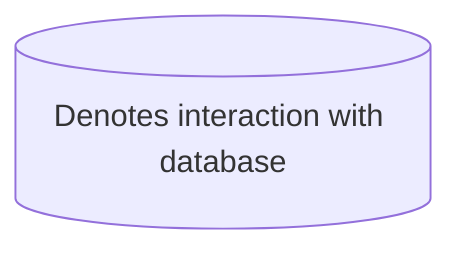
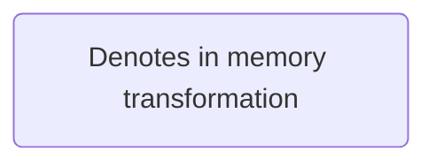
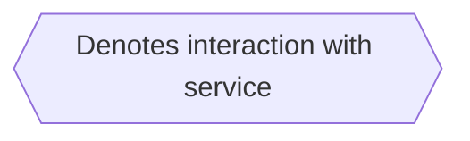
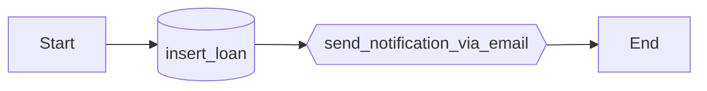
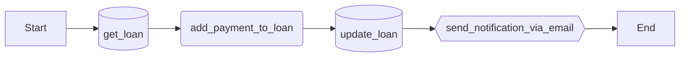

# One workflow, one use case

To me, one of best ways to think about a use case is that each one of these **must satisfy one and only one requirement your software may have.** For example, let's say we are building a lending application, some use cases that must be satisfied by the applications are:

- `open loan` -> As a user I want to open a loans to my clients.
- `pay loan` -> As a user I want to registry a loan payments made by my clients.

Ok, so ***one workflow, one use case*** means that a use case can easily be thought as an orchestrated workflow that **interacts with the application database and/or other services** (for me, a service means a third party application I want to interact with). Let's think about the workflow for the two use cases we need for our application.

1. **Open Loan** use case.

1. **Pay Loan** use case.

This abstraction is easily extensible, assume we want to send some data to another service... well you just have to add a new step on your workflow use cases.
